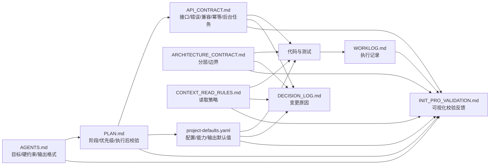
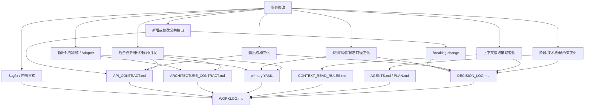

# Init Pro Validation Report

## Summary

- Project root: `/Users/stealmac/Documents/Inteliscope/infohub-light`
- Primary config: `project-defaults.yaml`
- Generated at: `2026-07-09 19:18:36`
- Overall status: `PASS`

- PASS: 42
- FAIL: 0

## Constraint Graph

## Change Impact Graph

## Scenario Matrix

| Scenario | Expected control-file update |
|---|---|
| Bug fix / internal refactor | WORKLOG.md only |
| New FastAPI endpoint | API_CONTRACT.md + WORKLOG.md |
| Breaking API change | API_CONTRACT.md + DECISION_LOG.md + WORKLOG.md |
| New adapter / external system | ARCHITECTURE_CONTRACT.md + primary YAML + DECISION_LOG.md + WORKLOG.md |
| Rule / threshold meaning change | primary YAML + DECISION_LOG.md + WORKLOG.md |
| Output shape change | API_CONTRACT.md + DECISION_LOG.md + WORKLOG.md |
| Background task / retry / timeout | API_CONTRACT.md + ARCHITECTURE_CONTRACT.md + primary YAML + DECISION_LOG.md + WORKLOG.md |
| Context read strategy change | CONTEXT_READ_RULES.md + DECISION_LOG.md + WORKLOG.md |
| Phase / stack / hard constraint change | AGENTS.md or PLAN.md + DECISION_LOG.md + WORKLOG.md |

## Control File Checks

| Status | File | Check | Detail |
|---|---|---|---|
| PASS | `AGENTS.md` | file exists | present |
| PASS | `AGENTS.md` | compact final response format | required markers found |
| PASS | `AGENTS.md` | control-file maintenance rule | required markers found |
| PASS | `AGENTS.md` | unique source-of-truth map | required markers found |
| PASS | `AGENTS.md` | default read scope | required markers found |
| PASS | `PLAN.md` | file exists | present |
| PASS | `PLAN.md` | default startup read scope | required markers found |
| PASS | `PLAN.md` | implementation hard constraints | required markers found |
| PASS | `PLAN.md` | test order | required markers found |
| PASS | `PLAN.md` | visual validation command | required markers found |
| PASS | `API_CONTRACT.md` | file exists | present |
| PASS | `API_CONTRACT.md` | capability/degrade response rule | required markers found |
| PASS | `API_CONTRACT.md` | error contract | required markers found |
| PASS | `API_CONTRACT.md` | compatibility contract | required markers found |
| PASS | `API_CONTRACT.md` | idempotency contract | required markers found |
| PASS | `API_CONTRACT.md` | background task contract | required markers found |
| PASS | `ARCHITECTURE_CONTRACT.md` | file exists | present |
| PASS | `ARCHITECTURE_CONTRACT.md` | layering | required markers found |
| PASS | `ARCHITECTURE_CONTRACT.md` | forbidden coupling | required markers found |
| PASS | `ARCHITECTURE_CONTRACT.md` | extension rule | required markers found |
| PASS | `DECISION_LOG.md` | file exists | present |
| PASS | `DECISION_LOG.md` | decision format | required markers found |
| PASS | `DECISION_LOG.md` | initial decision | required markers found |
| PASS | `CONTEXT_READ_RULES.md` | file exists | present |
| PASS | `CONTEXT_READ_RULES.md` | default required files | required markers found |
| PASS | `CONTEXT_READ_RULES.md` | default avoid list | required markers found |
| PASS | `CONTEXT_READ_RULES.md` | api task read strategy | required markers found |
| PASS | `CONTEXT_READ_RULES.md` | adapter task read strategy | required markers found |
| PASS | `CONTEXT_READ_RULES.md` | rules task read strategy | required markers found |
| PASS | `CONTEXT_READ_RULES.md` | output task read strategy | required markers found |
| PASS | `CONTEXT_READ_RULES.md` | storage/background task read strategy | required markers found |
| PASS | `CONTEXT_READ_RULES.md` | frontend task read strategy | required markers found |
| PASS | `WORKLOG.md` | file exists | present |
| PASS | `WORKLOG.md` | append template | required markers found |
| PASS | `WORKLOG.md` | initial scaffold record | required markers found |
| PASS | `project-defaults.yaml` | file exists | present |
| PASS | `project-defaults.yaml` | phase | required markers found |
| PASS | `project-defaults.yaml` | capability degrade | required markers found |
| PASS | `project-defaults.yaml` | evidence | required markers found |
| PASS | `project-defaults.yaml` | capabilities | required markers found |
| PASS | `project-defaults.yaml` | compact output | required markers found |
| PASS | `WORKLOG.md` | initial record includes primary config | primary config is listed in WORKLOG initial modified files |

## How To Use This Report

1. If overall status is `PASS`, the control scaffold is structurally complete.
2. If any row is `FAIL`, fix the listed file before continuing implementation.
3. After completing a planned business change, compare the change type against the scenario matrix and confirm `WORKLOG.md` records the actual control-file updates.
