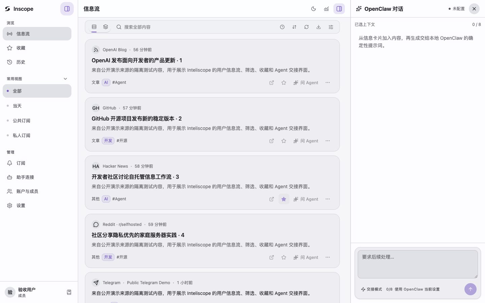

# Inteliscope

> A privacy-first, self-hosted information hub for small teams and personal agents.

[简体中文](README_zh.md) · [API contract](docs/contracts/api/) · [Architecture](docs/contracts/architecture/) · [UI contract](docs/contracts/ui/)

<p align="center">
  
</p>

## Why Inteliscope?

Most open-source feed readers focus on a single user, while team-oriented information platforms are often closed and hosted by third parties. Inteliscope provides a privacy-first, self-hosted middle ground: multi-user roles, scoped subscriptions, scheduled acquisition, source-health diagnostics, notifications, and optional MCP access for personal agents.

It unifies RSS/Atom, GitHub, Reddit, Telegram, Hacker News, and controlled social-source acquisition while keeping accounts, secrets, feed history, and automation under the operator's control.

## Current product

- Per-user accounts and `owner/admin/member/viewer` roles.
- Public, workspace, and private source subscriptions.
- RSS/Atom, GitHub releases/users, Reddit subreddits/users, Telegram channels, Apify social targets, and Hacker News.
- Manual, per-user scheduled Feed refresh, and per-subscription scheduled source fetch through the same SQLite-backed Worker queue.
- User-scoped Feed snapshots, stable saved/later content, explicit read/unread state, captured-body detail, protected media, history, and source health.
- Editable source and subscription settings, connection tests, refetch, partial/failure diagnostics, and source priority ordering.
- Bounded per-item summaries and owner/admin write-only management of AI and Apify keys.
- Optional user-scoped Remote MCP for each user's own OpenClaw, with self-managed connections, safe reads, gated subscription writes, and a bundled Skill.
- Opt-in per-source notifications through current Email, Webhook, and Telegram Service transports.

Graph, archive analytics, recommendation learning, in-site article proxying, daily summary publishing, the static-site publisher, and the local stdio MCP are retired. Their historical files are not read, migrated, or deleted by the current runtime.

## Default runtime

The default deployment contains exactly two services:

```text
horizon-api     FastAPI, React reader UI, authentication and Service APIs
horizon-worker  acquisition jobs, Feed finalization, schedules and source health
```

There is no scheduler or legacy publisher service. Both automatic Feed refresh and per-source schedules run inside `horizon-worker`.

## Local Docker start

```bash
cp .env.example .env

# For a fresh database, configure an initial owner with either a password
# or a PBKDF2 password hash before the first start.
# HORIZON_AUTH_USER=admin
# HORIZON_AUTH_PASSWORD_HASH=...

./scripts/up-latest.sh
docker compose -f docker-compose.light.yml ps
curl http://127.0.0.1:8080/api/health/live
curl http://127.0.0.1:8080/api/health/ready
```

Each successful local cutover removes stale `inteliscope-service:local-*` image
tags after the final API/Worker health check. It never removes the image just
started or forces removal of an image still referenced by a container. Set
`HORIZON_PRUNE_OLD_LOCAL_BUILDS=false` in `.env` to retain old local builds.

Open [http://127.0.0.1:8080/](http://127.0.0.1:8080/), log in, create or subscribe to a source, and select “获取新内容”.

When this command runs from a linked task Worktree, it builds that Worktree and mounts `.env`, `data`, and `logs` from the primary checkout resolved through Git's common directory. Use `--runtime-root /absolute/path` only to select another runtime intentionally, and `--dry-run` to inspect the resolved roots without calling Docker. The authoritative completion and migration-safety rules are in [AGENTS.md](AGENTS.md#6-verification). Production images do not contain `.env`, `service.db`, `data/config.json`, logs, or backups.
API and Worker runtime/operation logs are private UTC-rotated JSONL files with a 30-day default retention. See the [diagnostic logging developer guide](docs/dev/observability-logging.md); logs are never rendered in the frontend.

The default Service UI is the React three-column radar. For frontend development:

```bash
cd frontend
npm ci
npm run dev       # Vite on 127.0.0.1:5173, /api proxied to FastAPI :8080
npm test
npm run typecheck
npm run e2e
```

React is the only UI. If its build output is missing, FastAPI and Remote MCP still start while non-API pages return 404; there is no legacy fallback.

Owner/admin users can add and rotate AI/Apify keys in the configuration page. Values are write-only, stored in ignored `data/secrets.env` with mode `0600`, hot-loaded by API and Worker, and never returned to the browser. `data/config.json` and SQLite contain only the selected environment-variable reference.

## Authentication

The Service API always requires an application account; there is no environment switch that disables Service authentication.

For HTTPS deployments:

```bash
HORIZON_AUTH_SECURE_COOKIE=true
HORIZON_AUTH_SESSION_TTL_SECONDS=604800
```

Nginx Basic Auth may be used as an additional outer gate, but it never replaces the application account and role checks.

## Local OpenClaw assistant

Remote MCP is disabled by default and does not run an Agent or model on the server. When enabled, every role can create a connection from `/agents`; the clear-text token is shown once. A read connection exposes thirteen safe Feed, subscription, source guidance, bounded public Bilibili account lookup, generic verified source resolution (initially YouTube), health, job, diagnosis, and sanitized operation-event tools for that user. Subscription changes require a separately authorized connection and server flag.

Browser chat is a separate opt-in connection. The browser connects directly to the user's OpenClaw Gateway v4; Inteliscope never proxies the Gateway or stores its bootstrap token. Local development accepts only `ws://127.0.0.1` or `ws://localhost`, while a remote per-user Gateway must use `wss://`. Paired browser credentials are isolated by Inteliscope user and Gateway URL. Turning the chat flag off restores the copy-only handoff without affecting Remote MCP.

Set `HORIZON_OPENCLAW_IMAGE_IO_ENABLED=true` to allow JPEG, PNG, and WebP input through the stock `chat.send.attachments` protocol when the selected model declares `image` input. `HORIZON_OPENCLAW_MEDIA_ORIGINS` is not required for input; it only allowlists Gateway media origins when the optional `chat.media.ticket` extension is available for assistant/history image display.

For local development:

```bash
HORIZON_REMOTE_MCP_ENABLED=true
HORIZON_REMOTE_MCP_PUBLIC_URL=http://127.0.0.1:8080/mcp
HORIZON_REMOTE_MCP_SUBSCRIPTION_WRITES_ENABLED=false
HORIZON_OPENCLAW_CHAT_ENABLED=false
HORIZON_OPENCLAW_GATEWAY_DEFAULT_URL=ws://127.0.0.1:18789
```

For first-time local integration, use the idempotent bootstrap. It discovers the
actual Gateway URL, merges the current browser Origin, updates `.env`, installs
or refreshes the bundled Skill, restarts the Gateway only when the Skill or
Origin changed, starts the services, and verifies readiness. It never reads or
stores Gateway/MCP tokens and never approves a device. After a Skill refresh,
start a new OpenClaw conversation so an existing transcript cannot retain old
source-routing instructions:

```bash
./scripts/setup_openclaw_local.sh --dry-run
./scripts/setup_openclaw_local.sh
```

The default reuses the current Docker image; pass `--rebuild` to rebuild the
working tree. Afterward, create a read-only connection on `/agents`, run its
generated MCP commands, then pair the Feed panel with `openclaw dashboard`.

Install and configure the bundled Skill by following [`integrations/openclaw/inteliscope/README.md`](integrations/openclaw/inteliscope/README.md). `/mcp` is the only MCP server shipped by this repository.

The local acceptance benchmark uses an isolated temporary database and 100 real MCP client calls:

```bash
./.venv/bin/python scripts/benchmark_remote_mcp.py
```

## `rb.jiefs.top` deployment

Normal upgrades use one guarded command from a clean `main` that exactly matches `origin/main`:

```bash
./scripts/release_vps.sh preflight vX.Y.Z
./scripts/release_vps.sh release vX.Y.Z
./scripts/release_vps.sh status
./scripts/release_vps.sh rollback [release-id]
```

The release command reuses the successful Test Gate for the exact main SHA, builds the pinned `linux/amd64` image locally while CI completes, uploads the source and image concurrently with resumable `rsync`, pushes the tag only after main is green, and waits for the tag's isolated API smoke before cutover. The VPS only performs `docker load`; it never builds this repository. Before replacing API and Worker it checks for active jobs, blocks cutover if a residual historical scheduler container is running, creates private online database and environment backups, and automatically restarts the previous immutable API/Worker release if readiness or asset verification fails. A release that contains database migration work is refused and must use its explicit migration runbook.

The public target is `https://rb.jiefs.top/`. VPS releases live under `/opt/inteliscope/releases/<release-id>` and share `/opt/inteliscope/{data,logs,.env}`. The local release image is removed after the command finishes so release builds do not accumulate. `scripts/release_rc1.sh` remains only for a first-time empty-database bootstrap; it is not the normal upgrade path.

## Verification

```bash
python scripts/test_gate.py run --mode full
python scripts/test_gate.py run --mode release
git diff --check
```

## Retired data boundary

Existing `data/site/**`, `data/horizon.db`, generated summaries, local MCP runs, and legacy feedback rows remain operator-owned inert artifacts. The current API, Worker, React UI, Remote MCP, initialization, and migrations do not read, rewrite, migrate, or physically delete them. Current cold archives under `data/archives/**` and Service DB snapshot compatibility remain supported.

Inteliscope is derived from [Thysrael/Horizon](https://github.com/Thysrael/Horizon) and remains MIT licensed.
