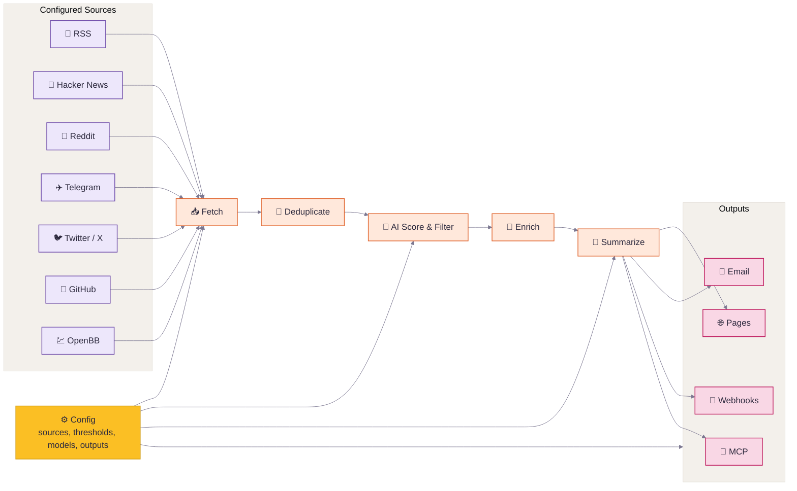

<div align="center">

# Inteliscope

**A personal AI information radar, second-developed from Horizon for focused reading workflows.**

[](LICENSE)
[](https://github.com/astral-sh/uv)

<br>


📡 Your own AI-powered reading radar. Generates AI-ranked briefings and a focused reading UI. | 面向个人内容阅读的 AI 信息雷达

[Upstream Horizon](https://github.com/Thysrael/Horizon) · [Upstream Demo](https://thysrael.github.io/Horizon/) · [简体中文](README_zh.md)

</div>

> **Fork notice**
>
> Inteliscope is a personal second-development edition based on [Thysrael/Horizon](https://github.com/Thysrael/Horizon). It keeps the upstream collection, scoring, summarization, and delivery pipeline, while adding private configuration, a content-reader style web UI, and local workflow adjustments for personal information tracking.

## Screenshots

<table>
<tr>
<td width="50%">
<p align="center"><strong>Ranked Daily Briefing</strong></p>

</td>
<td width="50%">
<p align="center"><strong>Context, Summary & Discussion</strong></p>

</td>
</tr>
</table>

<details>
<summary><strong>More Screenshots</strong></summary>
<br>
<table>
<tr>
<td width="33.33%">
<p align="center"><strong>Terminal Output</strong></p>

</td>
<td width="33.33%">
<p align="center"><strong>Feishu Notification</strong></p>

</td>
<td width="33.33%">
<p align="center"><strong>Email Delivery</strong></p>

</td>
</tr>
</table>
</details>

## Why Inteliscope?

Good news is scattered; bad news is endless. Inteliscope gives you a personal first pass over Hacker News, Reddit, Telegram, RSS, GitHub, and other sources: it fetches, deduplicates, scores, filters, and enriches stories with background context and community discussion.

This fork is built around daily reading rather than a public demo site. AI reduces noise, but information tracking still needs human taste: the sources you trust, the comments that change how you read a story, and the signals worth following. Inteliscope keeps Horizon's pipeline and adds a calmer reader-oriented web UI plus private defaults for personal use.

## Features

- **📡 Watch Your Own Sources** — Track Hacker News, RSS, Reddit, Telegram, Twitter/X, GitHub releases or user activity, and OpenBB financial news watchlists in one pipeline
- **🤖 Turn Noise Into a Reading List** — Score each item from 0-10 with Claude, GPT, Gemini, DeepSeek, Doubao, MiniMax, Ollama, or any OpenAI-compatible API
- **🔗 Merge Repeated Stories** — Deduplicate the same story across platforms before it reaches your briefing
- **🔍 Understand the Background** — Add web-researched context for unfamiliar concepts, companies, projects, and technical terms
- **💬 Read the Conversation** — Collect and summarize community comments from Hacker News, Reddit, and other supported sources
- **🌐 Publish in Two Languages** — Generate English and Chinese daily briefings from the same source set
- **📝 Ship a Daily Site** — Publish generated Markdown as a GitHub Pages daily briefing site
- **📧 Deliver by Email** — Run a self-hosted SMTP/IMAP newsletter with automatic subscribe and unsubscribe handling
- **🔔 Push to Chat or Automations** — Send templated results to Feishu/Lark, DingTalk, Slack, Discord, or custom webhook endpoints
- **🧙 Start From Your Interests** — Use the setup wizard to generate a personalized source configuration
- **⚙️ Tune the Radar** — Customize sources, thresholds, models, languages, and delivery channels from one JSON config

## How It Works



1. **Define** — Configure sources, thresholds, models, languages, and delivery from one JSON config.
2. **Fetch** — Pull latest content from all configured sources concurrently.
3. **Deduplicate** — Merge items pointing to the same story or URL across platforms.
4. **Score & Filter** — Use AI to rank items and keep only those above your threshold.
5. **Enrich** — Search the web for background context and collect community discussion for important items.
6. **Summarize** — Generate a structured Markdown briefing with summaries, tags, and references.
7. **Deliver** — Publish the result to GitHub Pages, email, webhooks such as Feishu, MCP, or local files.

## Quick Start

### 1. Install

**Option A: Local Installation**

```bash
git clone <your-inteliscope-repo-url>
cd Inteliscope

# Install with uv (recommended)
uv sync

# Install test/development extras when needed
uv sync --extra dev

# Or with pip
pip install -e .
```

`dev` is currently defined as an optional extra in `pyproject.toml`, so use `uv sync --extra dev` for pytest and other development dependencies.

If you want the optional OpenBB financial-news source, install its extra too:

```bash
uv sync --extra openbb
```

If `openbb` pulls packages without wheels on your machine, install the SDK manually with binaries only:

```bash
uv pip install --only-binary=:all: openbb openbb-benzinga
```

**Option B: Docker**

```bash
git clone <your-inteliscope-repo-url>
cd Inteliscope

# Configure environment
cp .env.example .env
# data/config.json is already an Inteliscope starter config for this fork.
# Edit .env and data/config.json with your API keys, sources, thresholds, and webhook.

# Rebuild current workspace, replace old containers, and prune old build cache
./scripts/up-latest.sh

# Run one manual fetch/score/summarize/push job
docker compose run --rm horizon --hours 24

# Or run with a custom time window
docker compose run --rm horizon --hours 48
```

Use `./scripts/up-latest.sh` for local Docker starts. It runs
`docker compose build --pull --no-cache` by default, recreates the running services with
`--no-build --force-recreate --remove-orphans`, then prunes old dangling images for this Compose
project and old Docker build cache. Avoid bare `docker compose up -d` if you want to
guarantee the container uses the latest local code. Set `HORIZON_BUILD_NO_CACHE=false`
for faster cached rebuilds, or `HORIZON_PRUNE_BUILD_CACHE_UNTIL=0h` for aggressive build
cache cleanup.

### 2. Configure

**Option A: Interactive wizard (recommended)**

```bash
uv run horizon-wizard
```

The wizard asks about your interests (e.g. "LLM inference", "嵌入式", "web security") and auto-generates `data/config.json`.

**Option B: Manual configuration**

```bash
cp .env.example .env          # Add your API keys
cp data/config.example.json data/config.json  # Customize your sources
```

Minimal manual configuration:

```jsonc
{
  "ai": {
    "provider": "openai",
    "model": "gpt-4",
    "api_key_env": "OPENAI_API_KEY"
  },
  "sources": {
    "rss": [
      { "name": "Simon Willison", "url": "https://simonwillison.net/atom/everything/" }
    ]
  },
  "filtering": {
    "ai_score_threshold": 6.0
  }
}
```

`api_key_env` must be the name of an environment variable, not the API key
itself. Put the real secret in `.env`:

```bash
OPENAI_API_KEY=sk-your-key
```

For Gemini, use `GOOGLE_API_KEY`:

```jsonc
{
  "ai": {
    "provider": "gemini",
    "model": "gemini-2.0-flash",
    "api_key_env": "GOOGLE_API_KEY"
  }
}
```

For Xiaomi MiMo Token Plan, use `XIAOMI_API_KEY` and the China cluster endpoint:

```jsonc
{
  "ai": {
    "provider": "xiaomi",
    "model": "mimo-v2.5-pro",
    "base_url": "https://token-plan-cn.xiaomimimo.com/v1",
    "api_key_env": "XIAOMI_API_KEY"
  }
}
```

Any string value in `data/config.json` can reference environment variables with `${VAR_NAME}`. This is useful for values such as `ai.base_url`, private RSS feed URLs, webhook endpoints, or custom header templates.

For the full reference, see the [Configuration Guide](docs/configuration.md).

### 3. Run

#### Local Installation

```bash
uv run horizon           # Run with default 24h window
uv run horizon --hours 48  # Fetch from last 48 hours
```

#### With Docker

```bash
./scripts/up-latest.sh                      # Start scheduler + web UI
docker compose run --rm horizon           # Run with default 24h window
docker compose run --rm horizon --hours 48  # Fetch from last 48 hours
docker compose logs -f horizon-scheduler  # Watch scheduler logs
```

The generated report is saved to `data/summaries/`. The private web UI is served from `data/site/` at [http://localhost:8080](http://localhost:8080) by default.

## Inteliscope Docker Deployment

This repository includes an Inteliscope private reading-radar configuration in `data/config.json`. It keeps Horizon's original pipeline and adds:

- Chinese scoring output with `score`, `reason`, `tags`, `category`, `is_featured`, `summary_zh`, and `action_suggestion`
- Featured threshold `>= 7.5`, daily push threshold `>= 8.5`, and top 10 push limit
- RSS/Atom, GitHub releases, GitHub public events, Hacker News, Reddit, Telegram public channels, OSS Insight, and Apify social subscriptions for public X, Instagram, Facebook, and Telegram targets
- Static web UI with featured feed, recent 20 all-items feed, historical archive, daily summary, tag/source/search/score filters, and localStorage favorites
- Structured config UI for sources, controlled tag categories, personal tags, thresholds, AI model, and webhook settings, backed by server-side validation, optional admin auth, and config backups
- Controlled tag taxonomy: AI Agent, AI coding, model releases, RAG/MCP, AI infra, open models, inference, products/startups, research, safety/governance, and industry updates
- Docker Compose short polling every 30 minutes, daily webhook push at `08:30 Asia/Shanghai`, data mounts, log mounts, and web health check

Deployment:

```bash
git clone <your-inteliscope-repo-url>
cd Inteliscope
cp .env.example .env

# Edit OPENAI_API_KEY or another provider key in .env.
# Enable HORIZON_AUTH_ENABLED before sharing the web server with friends.
# Use the Web UI config tab to edit sources, tags, thresholds, and webhook.
./scripts/up-latest.sh
docker compose logs -f horizon-scheduler
```

Manual run and checks:

```bash
# Run one complete fetch + AI score + summary + optional webhook push.
docker compose run --rm horizon --hours 24

# Preview webhook rendering without sending.
docker compose run --rm --entrypoint uv horizon run horizon-webhook --lang zh --dry-run

# Open the static UI.
open http://localhost:8080
```

Important config notes:

- Put secrets only in `.env`; `data/config.json` stores environment variable names such as `OPENAI_API_KEY`, `GITHUB_TOKEN`, `APIFY_TOKEN`, and `HORIZON_WEBHOOK_URL`.
- For shared deployments, set `HORIZON_AUTH_ENABLED=true`, `HORIZON_AUTH_USER`, `HORIZON_AUTH_PASSWORD_HASH`, and `HORIZON_AUTH_SESSION_SECRET`. Generate a hash with `docker compose run --rm --entrypoint sh horizon -lc "python -m src.ui.auth hash-password 'change-me'"`. Once enabled, the feed stays readable while `/api/config`, config saves, and source tests require login.
- Keep `sources.apify_social.enabled=false` and `sources.twitter.enabled=false` unless `APIFY_TOKEN` is configured.
- Set `webhook.enabled=true` only after `HORIZON_WEBHOOK_URL` is set. `platform` may be `generic`, `feishu`, `lark`, `dingtalk`, `slack`, or `discord`.
- Logs are mounted to `./logs`; scheduler failures and webhook failures are written there and also visible via `docker compose logs`.

### Direct Source Fetching, No AIHub Dependency

This private radar does not require or reverse-engineer any third-party AIHub/AIHOT-style aggregator API. Sources are split by adapter and fetched directly from public origin endpoints or official APIs:

```bash
docker compose run --rm --entrypoint uv horizon run horizon-sources
docker compose run --rm --entrypoint uv horizon run horizon-sources --json
```

The current direct-source adapters cover RSS/Atom, GitHub REST API, Hacker News Firebase API, Reddit public JSON, Telegram public channel pages, OSS Insight public API, and optional OpenBB. Public X, Instagram, Facebook, and Telegram social subscriptions can also be fetched through Apify when `APIFY_TOKEN` is configured; private groups, private channels, friends feeds, cookies, sessions, and passwords are intentionally out of scope.

### 4. Automate (Optional)

Horizon works great as a **GitHub Actions** cron job. See [`.github/workflows/daily-summary.yml`](.github/workflows/daily-summary.yml) for a ready-to-use workflow that generates and deploys your daily briefing to GitHub Pages automatically.

## Supported Sources

| Source | What it fetches | Comments |
|--------|----------------|----------|
| **Hacker News** | Top stories by score | Yes (top N comments) |
| **RSS / Atom** | Any RSS or Atom feed | — |
| **Reddit** | Subreddits + user posts | Yes (top N comments) |
| **Telegram** | Public channel messages | — |
| **Twitter / X** | Tweets from specific users | Yes (top N replies) |
| **GitHub** | User events & repo releases | — |
| **OpenBB** | Financial company news by watchlist/provider | — |

## Where Your Briefing Goes

Horizon can publish or deliver the generated briefing in several ways:

| Channel | What it does |
|---------|--------------|
| **GitHub Pages Daily Site** | Copies generated Markdown into `docs/` so GitHub Pages can publish a daily-updated briefing site |
| **Email Subscription** | Sends the daily briefing to subscribers and handles subscribe/unsubscribe requests through SMTP/IMAP |
| **Webhook Notification** | Pushes success or failure results to Feishu/Lark, DingTalk, Slack, Discord, or any custom webhook endpoint |
| **MCP Server** | Exposes Horizon pipeline steps as tools so AI assistants can fetch, score, filter, enrich, summarize, and run the full workflow |

For setup details, see the [Configuration Guide](docs/configuration.md). For MCP tool references and client setup, see [`src/mcp/README.md`](src/mcp/README.md) and [`src/mcp/integration.md`](src/mcp/integration.md).

## Supported By

Horizon is an open-source project maintained in spare time. If you'd like to support the project or be listed here, feel free to [open an issue](https://github.com/Thysrael/Horizon/issues/new) or [email me](mailto:thysrael@163.com).

| Supporter | Details |
|-----------|---------|
| [](https://www.compshare.cn/?ytag=GPU_YY_git_Horizon) | Compshare currently supports Horizon. Compshare is UCloud's AI cloud platform, offering cost-effective monthly and pay-as-you-go domestic model agent plans starting from RMB 49/month, as well as stable officially relayed overseas models. It supports Claude Code, Codex, and API usage, with enterprise-grade high concurrency, 24/7 technical support, and self-service invoicing.<br><br>Register through their [link](https://www.compshare.cn/?ytag=GPU_YY_git_Horizon) to receive a free RMB 5 trial credit. |

## Documentation

| Guide | Description |
|-------|-------------|
| [Configuration](docs/configuration.md) | AI providers, sources, filtering, email, webhook, GitHub Pages, and MCP setup |
| [Scoring](docs/scoring.md) | How Horizon evaluates and ranks news items |
| [Scrapers](docs/scrapers.md) | Source scraper details and extension notes |
| [MCP Tools](src/mcp/README.md) | Tool reference for MCP-compatible clients |

## Project Status

Horizon already supports the full daily briefing loop: multi-source collection, AI scoring, deduplication, enrichment, comment summaries, bilingual generation, GitHub Pages publishing, email delivery, webhook delivery, Docker deployment, MCP integration, and the setup wizard.

Planned improvements:

- More source types, such as Discord
- Custom scoring prompts per source
- Publish releases on GitHub
- Publish the package to PyPI for `pip install`

## Contributing

Contributions are welcome. See [CONTRIBUTING.md](CONTRIBUTING.md) for code, documentation, and source-sharing guidelines.

### Share Sources

Want to share valuable source discoveries with the Horizon community? Please submit them through **[horizon1123.top](https://horizon1123.top)**.

## Acknowledgements

- Special thanks to [LINUX.DO](https://linux.do/) for providing a promotion platform.
- Special thanks to [HelloGitHub](https://hellogithub.com/) for valuable guidance and suggestions.
- Special thanks to [AIGC Link](https://xhslink.com/m/80ngts127cA) for the promotions on XiaoHongShu.

## License

[MIT](LICENSE)
