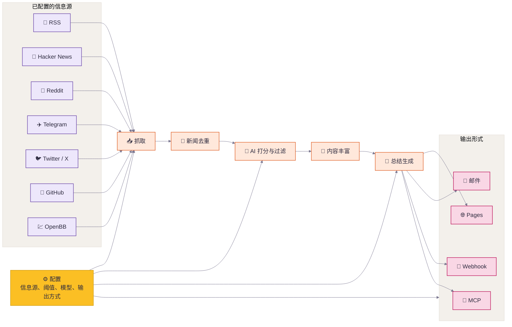

<div align="center">

# Inteliscope

**基于 Horizon 二次开发的个人 AI 信息雷达。**

[](LICENSE)
[](https://github.com/astral-sh/uv)


<br>


📡 面向个人内容阅读的 AI 信息雷达，生成 AI 排序的阅读清单和日报。 | Your own AI-powered reading radar.

[上游 Horizon](https://github.com/Thysrael/Horizon) · [上游演示](https://thysrael.github.io/Horizon/) · [English](README.md)

</div>

> **二开说明**
>
> Inteliscope 是基于 [Thysrael/Horizon](https://github.com/Thysrael/Horizon) 的个人二次开发版本。当前多人 Service 主线是来源订阅、抓取、Feed 展示与用户历史留存；上游 AI 评分、摘要、分发及全局静态发布由旧 CLI/scheduler 作为可选兼容链路保留。

## 截图

<table>
<tr>
<td width="50%">
<p align="center"><strong>按优先级排序的日报</strong></p>

</td>
<td width="50%">
<p align="center"><strong>背景、总结与评论</strong></p>

</td>
</tr>
</table>

<details>
<summary><strong>More Screenshots</strong></summary>
<br>
<table>
<tr>
<td width="33.33%">
<p align="center"><strong>终端输出</strong></p>

</td>
<td width="33.33%">
<p align="center"><strong>飞书通知</strong></p>

</td>
<td width="33.33%">
<p align="center"><strong>邮件推送</strong></p>

</td>
</tr>
</table>
</details>

## 为什么需要 Inteliscope？

好内容分散在各处，噪声却源源不断。Inteliscope 为你先完成第一轮筛选：从 Hacker News、Reddit、Telegram、RSS、Twitter/X、GitHub、OpenBB 等来源抓取内容，合并重复信息，用 AI 打分过滤，并为重要内容补充背景解释和社区讨论。

这个二开版本更偏个人日常阅读，而不是公开演示站。AI 很擅长降低噪声，但信息追踪仍然需要人的品味：你信任哪些信息源，哪些评论改变了你对事件的理解，哪些信号值得继续跟进。Inteliscope 保留 Horizon 的处理链路，并加入更克制的阅读器式 Web UI 和私人默认配置。

## 功能特性（Service 与旧 CLI）

- **📡 关注你的信息源** — 将 Hacker News、RSS、Reddit、Telegram、Twitter/X、GitHub Release / 用户动态，以及 OpenBB 金融新闻观察列表纳入同一条 pipeline
- **🤖 把噪声变成阅读清单** — 使用 Claude、GPT、Gemini、DeepSeek、豆包、MiniMax 或任意 OpenAI 兼容 API，为每条内容评分 0-10
- **🔗 合并重复新闻** — 在生成日报前自动合并来自不同平台的相同故事
- **🔍 补全背景知识** — 为陌生概念、公司、项目和技术术语补充网络搜索得到的背景解释
- **💬 读到社区声音** — 收集并总结 Hacker News、Reddit 等来源的评论讨论
- **🌐 生成双语日报** — 基于同一组信息源生成英文和中文日报
- **📝 发布日报站点** — 将生成的 Markdown 发布为 GitHub Pages 静态日报站点
- **📧 邮件分发** — 运行自托管 SMTP/IMAP 邮件列表，自动处理订阅与退订
- **🔔 推送到聊天和自动化工具** — 将模板化结果发送到飞书、钉钉、Slack、Discord 或自定义 Webhook
- **🧙 从兴趣开始配置** — 通过交互式向导根据你的兴趣生成个性化信息源配置
- **⚙️ 调校你的新闻雷达** — 在单个 JSON 配置中定制信息源、阈值、模型、语言和分发方式

## 旧 CLI 可选处理与分发链路

下图描述上游兼容的完整 CLI pipeline，不代表默认多人 Service 会启动摘要、推送、全局 archive 或 Graph。



1. **定义** — 用一个 JSON 配置好信息源、阈值、模型、语言和分发方式。
2. **抓取** — 并发拉取所有已配置信息源的最新内容。
3. **去重** — 合并来自不同平台、指向同一故事或 URL 的内容。
4. **打分与过滤** — 用 AI 对内容排序，只保留超过阈值的条目。
5. **丰富** — 为重要内容补充搜索得到的背景信息和社区讨论。
6. **总结** — 生成结构化的 Markdown 日报，包含摘要、标签和参考链接。
7. **分发** — 将结果发布到 GitHub Pages、邮件、飞书等 webhook、MCP 或本地文件。

## 赞助

Horizon 是一个业余时间维护的开源项目。如果你愿意支持这个项目，或希望出现在这里，欢迎[创建一个 Issue](https://github.com/Thysrael/Horizon/issues/new) 或[发邮件](mailto:thysrael@163.com)联系我。

| 支持方 | 说明 |
|--------|------|
| [](https://www.compshare.cn/?ytag=GPU_YY_git_Horizon) | 优云智算目前正在支持 Horizon。优云智算是 UCloud 旗下 AI 云平台，主打包月、按次的高性价比国模 Agent Plan 套餐，低至 49 元/月起，同时提供官转稳定海外模型。支持接入 Claude Code、Codex 及 API 调用，支持企业高并发、7*24 技术支持和自助开票。<br><br>通过其[链接](https://www.compshare.cn/?ytag=GPU_YY_git_Horizon)注册，可获得 5 元平台体验金。 |

## 快速开始

### 1. 安装

#### 方式 A：本地安装

```bash
git clone <your-inteliscope-repo-url>
cd Inteliscope

# 使用 uv 安装（推荐）
uv sync

# 需要测试/开发依赖时
uv sync --extra dev

# 或使用 pip
pip install -e .
```

当前 `dev` 在 `pyproject.toml` 中定义为 optional extra，因此安装 `pytest` 等开发依赖时应使用 `uv sync --extra dev`。

如果你要启用可选的 OpenBB 金融新闻源，还需要安装对应 extra：

```bash
uv sync --extra openbb
```

如果 `openbb` 在你的机器上会拉到缺少 wheel 的依赖，建议改用只安装二进制包：

```bash
uv pip install --only-binary=:all: openbb openbb-benzinga
```

#### 方式 B：Docker

```bash
git clone <your-inteliscope-repo-url>
cd Inteliscope

# 配置环境
cp .env.example .env
# 当前仓库已提供 Inteliscope 二开版 data/config.json。
# 编辑 .env 和 data/config.json，填入 API 密钥、信源、阈值和 Webhook。
# 首次启动多人 Service API 前，必须在 .env 设置 HORIZON_AUTH_PASSWORD，
# 或设置 HORIZON_AUTH_PASSWORD_HASH；否则不会创建 owner，页面无法登录。
# 此时 /api/health/live 仍返回存活，但 /api/health/ready 会以 503
# auth_not_configured 明确阻止流量进入不可登录的实例。

# 按当前代码重建 API + Worker，验证 build revision 与 readiness 后再清理旧缓存
./scripts/up-latest.sh

# 手动运行一次抓取 / 打分 / 摘要 / 推送任务
docker compose run --rm horizon --hours 24

# 或自定义时间窗口
docker compose run --rm horizon --hours 48
```

`./scripts/up-latest.sh` 是本地推荐启动方式：默认执行
`docker compose build --pull --no-cache`，再用
`docker compose up -d --no-build --force-recreate --remove-orphans` 替换旧容器；只有 liveness 返回目标 revision 且 readiness 通过后，才清理本项目旧 dangling 镜像和 build cache。公网 RC 使用下文的分阶段发布脚本，不直接运行该本地脚本。
如果要加快构建，可设 `HORIZON_BUILD_NO_CACHE=false`；如果要更激进清理 build cache，
可设 `HORIZON_PRUNE_BUILD_CACHE_UNTIL=0h`。

### 2. 配置

**方式 A：交互式向导（推荐）**

```bash
uv run horizon-wizard
```

向导会询问你的兴趣（如"LLM 推理"、"嵌入式"、"web 安全"），自动推荐并生成 `data/config.json`，还可选让 AI 补充推荐小众源。若你想分享信息源，请前往 [horizon1123.top](https://horizon1123.top/)。

**方式 B：手动配置**

```bash
cp .env.example .env          # 添加 API 密钥
cp data/config.example.json data/config.json  # 自定义信息源
```

最小手动配置示例：

```jsonc
{
  "ai": {
    "provider": "openai",
    "model": "gpt-4",
    "api_key_env": "OPENAI_API_KEY"
  },
  "sources": {
    "rss": [
      { "name": "Simon Willison", "url": "https://simonwillison.net/atom/everything/" }
    ]
  },
  "filtering": {
    "ai_score_threshold": 6.0
  }
}
```

小米 MiMo Token Plan 可使用 OpenAI 兼容配置：

```jsonc
{
  "ai": {
    "provider": "xiaomi",
    "model": "mimo-v2.5-pro",
    "base_url": "https://token-plan-cn.xiaomimimo.com/v1",
    "api_key_env": "XIAOMI_API_KEY"
  }
}
```

旧 CLI 的 `data/config.json` 字符串仍可通过 `${VAR_NAME}` 引用环境变量。多人 catalog RSS URL 明确禁止环境变量占位，密钥只能保存为环境变量名引用，避免把 Worker 密钥拼入外发 URL。

完整配置参考请查看[配置指南](docs/configuration.md)。

### 3. 运行

#### 本地安装

```bash
uv run horizon              # 使用默认 24 小时窗口
uv run horizon --hours 48   # 抓取最近 48 小时的内容
```

#### 使用 Docker

```bash
./scripts/up-latest.sh                         # 默认启动 Service API + Worker
docker compose run --rm horizon              # 使用默认 24 小时窗口
docker compose run --rm horizon --hours 48   # 抓取最近 48 小时的内容
docker compose --profile scheduler up -d horizon-scheduler  # 显式启用 scheduler
docker compose logs -f horizon-api horizon-worker           # 查看多人服务日志
```

旧 CLI 生成的日报保存在 `data/summaries/`。多人 Web UI 默认通过 [http://localhost:8080](http://localhost:8080) 访问，当前产品范围是来源订阅、抓取、Feed 展示和用户历史留存；Feed 与历史来自用户作用域的 `service.db` snapshot，不读取全局 `data/site/*.json`。

默认 Service UI 已迁移为 React 三栏信息雷达。本地前端开发使用 `cd frontend && npm ci && npm run dev`，Vite 会把 `/api` 代理到 `127.0.0.1:8080`；`npm test`、`npm run typecheck`、`npm run e2e` 和 `npm run build` 分别执行单测、严格类型检查、三视口浏览器测试和生产构建。一个发布周期内可通过 `HORIZON_SERVICE_UI_VARIANT=legacy` 回退旧 Service UI，legacy CLI 静态发布链路不受影响。

既有 Service 数据库升级到 Feed v2 时不会自动清空或迁移数据。当前部署已于 2026-07-11 完成显式迁移、Docker API + Worker 和浏览器验收；其他旧数据库仍必须在停服和备份后显式迁移，未完成时 readiness 会返回 `migration_required`。

## Inteliscope Docker 部署

本仓库是基于 Horizon 的 Inteliscope 二开版本，已加入私人定制配置和输出：

- 日常访问、阅读、配置、运维和 Nginx 项目密码说明见 [Inteliscope 使用说明](docs/usage_zh.md)
- AI 打分输出 `score`、`reason`、`tags`、`category`、`is_featured`、`summary_zh`、`action_suggestion`
- `>= 7.5` 进入精选，`>= 8.5` 进入每日推送，推送最多 10 条
- 支持 RSS/Atom、GitHub Releases、GitHub 用户/组织动态、Hacker News、Reddit、Telegram 公共频道、OSS Insight；并支持通过 Apify 订阅公开 X、Instagram、Facebook、Telegram 目标
- 多人 React Service UI 使用侧边导航、信息列表和阅读详情三栏布局，支持精选/全部/稍后读/历史/日报、来源/关键词/未读筛选，以及打开原文、标记已读、复制摘要、收藏、稍后读和忽略；这些行为状态按用户保存在 Service DB
- 阅读页右上角“获取新内容”和订阅页“立即刷新”都会创建同一个用户 Feed 刷新任务；重复点击或多标签页提交会复用已有 queued/running job。选中或打开条目不会自动标记已读，只有点击“标记已读”才写入 Service API
- 订阅页提供每用户独立的“自动更新信息流”计划，默认关闭，可选 1/3/6/12/24 小时（默认 6 小时）；卡片显示上次/下次刷新、状态、产出、partial 问题和 Worker missing/stale 提示
- 每条订阅还可独立开启自动单源抓取，周期可选 30 分钟/1/3/6/12/24 小时；它复用同一 Worker、任务去重、Source Health 和用户 Feed 单源合并，不启动 legacy scheduler
- Service 历史由最近用户 snapshot 留存生成，不等同于旧 CLI 的全局 `data/site/history-data.json`；默认 UI 不提供站内原文预览、偏好反馈、Archive 分析、source-quality 或 Graph 入口
- 旧 CLI 可选生成全局 `history-data.json`、`data/horizon.db` 和 `article-graph.json` 作为 legacy compatibility 输出，Service UI/API 不依赖这些文件
- Web UI 内置登录、角色和配置后台，通过结构化表单维护信源、固定标签大类、个人标签、阈值、模型和 webhook；多人 Service API 始终要求登录
- 标签强约束为几大类：AI Agent、AI 编程、模型发布、RAG/MCP、AI Infra、开源模型、推理框架、产品创业、研究论文、安全治理、行业动态
- Docker Compose 默认只运行 API + Worker；scheduler、全局摘要和推送必须通过 `scheduler` profile 显式启用

部署步骤：

```bash
git clone <your-inteliscope-repo-url>
cd Inteliscope
cp .env.example .env

# 在 .env 中配置 OPENAI_API_KEY 或其他模型密钥。
# 多人 Service API 始终要求登录；首次启动前必须在 .env 二选一设置：
# HORIZON_AUTH_PASSWORD=<强密码>
# HORIZON_AUTH_PASSWORD_HASH=<下文命令生成的 hash>
# HORIZON_AUTH_ENABLED=false 只影响 legacy horizon-web，不会让 Service API 免登录。
# 可在 Web UI 的「配置」页调整信源、标签、阈值和 webhook.enabled。
./scripts/up-latest.sh
docker compose logs -f horizon-api horizon-worker
```

手动执行与检查：

```bash
# 手动跑一次完整流程；如果 webhook.enabled=true，会按每日推送规则推送。
docker compose run --rm horizon --hours 24

# 只预览 Webhook 渲染，不实际发送。
docker compose run --rm --entrypoint uv horizon run horizon-webhook --lang zh --dry-run

# 打开 Web UI。
open http://localhost:8080
```

如果页面看不到信息，先确认已登录并在「订阅」页创建订阅、刷新当前用户信息流。多人 Service 页面读取 `service.db` 的用户 snapshot；下面的旧 CLI 命令只负责全局静态发布，不会替代用户 Feed：

```bash
docker compose run --rm horizon --hours 24
```

多人 Service 控制台：

- 打开 [http://localhost:8080](http://localhost:8080)，切到「订阅」可立即刷新或设置默认关闭的每用户自动更新计划；启用前至少要有一个有效订阅
- 自动更新只复用现有 Worker 和用户 Feed，固定周期为 1/3/6/12/24 小时；它不会启动 legacy scheduler、摘要、通知或全局静态发布
- 在“我的订阅”编辑面板可为单个来源设置 30 分钟/1/3/6/12/24 小时自动抓取；手动和自动抓取会复用同一 active job
- 切到「配置」可维护高级来源和全局设置
- 用表单新增/修改 RSS、GitHub、Reddit、Telegram、Hacker News、标签库、AI 模型、阈值和 webhook
- 点击对应表单的「保存」
- 页面只显示环境变量是否已设置，不显示 `.env` 中的真实密钥
- 所有成员都需要账号登录；`viewer` 只读，修改全局配置需要 `owner/admin`。
- 默认订阅控制台只管理 dashboard、来源市场、我的订阅、任务和成员，不读取 Archive/source-quality。

账号初始化与 legacy Web 鉴权：

```bash
# 生成密码 hash，替换命令中的 change-me。
docker compose run --rm --entrypoint sh horizon -lc "python -m src.ui.auth hash-password 'change-me'"
```

多人 Service 至少需要设置 owner 用户名和密码 hash：

```bash
HORIZON_AUTH_USER=admin
HORIZON_AUTH_PASSWORD_HASH=<上一步生成的 hash>
HORIZON_AUTH_SESSION_TTL_SECONDS=604800
HORIZON_AUTH_SECURE_COOKIE=true  # 仅 HTTPS 部署设为 true
```

内测时也可以临时使用非空的 `HORIZON_AUTH_PASSWORD=` 明文密码，但发布到公网或半公网时优先使用 `HORIZON_AUTH_PASSWORD_HASH`。`HORIZON_AUTH_ENABLED` 只保留给 `legacy-web` profile；它不会关闭多人 Service 的登录门禁。

Service readiness 以数据库中是否存在至少一个启用用户为准。fresh DB 未配置 bootstrap 密码时，`/api/health/ready` 返回统一的 `503 auth_not_configured`，而 `/api/health/live` 仍返回 200；owner 首次创建后，即使后续从环境中移除 bootstrap 明文密码，只要仍有 enabled user，readiness 就不会受影响。

服务器可以额外使用 Nginx Basic Auth 保护整站。配置模板和步骤见 [deploy/nginx/README_zh.md](deploy/nginx/README_zh.md)。Basic Auth 只是外层门禁，不能替代应用登录和角色权限。

### `rb.jiefs.top` RC1 发布

> 当前公网发布已暂停，先完成本地 AI 概括、密钥管理和正式订阅闭环。以下命令仅保留为后续经再次授权后的发布路径。

公网目标固定为 `vps-tokyo:/opt/inteliscope` 和 `https://rb.jiefs.top/`。先生成不会修改本机正式库的脱敏副本：

```bash
./.venv/bin/python scripts/prepare_service_deployment.py \
  --source data/service.db \
  --output /tmp/inteliscope-service-rc1.db
```

发布脚本要求工作区已经形成经授权的干净 release commit；它会先跑完整本地门槛，再用 `git archive` 上传候选：

```bash
./scripts/release_rc1.sh prepare /tmp/inteliscope-service-rc1.db
./scripts/release_rc1.sh promote <release-id>
./scripts/release_rc1.sh status
```

`prepare` 只在 VPS 的 `127.0.0.1:18080` 启动 API；确认 staging 后，`promote` 才停止旧 Web、保持旧 scheduler 关闭，并在 8080 启动 API + Worker。失败时使用 `./scripts/release_rc1.sh rollback <release-id>`，回滚不会恢复 scheduler。

注意：

- Service 配置页写入的 AI/Apify 密钥只放 Git/Docker 忽略的 `data/secrets.env`，权限为 `0600` 且永不回显；`data/config.json` 和 SQLite 只写环境变量引用。legacy/其他集成密钥仍可放 `.env`。
- 未配置 `APIFY_TOKEN` 时保持 `sources.apify_social.enabled=false` 和 `sources.twitter.enabled=false`。
- 未配置 `HORIZON_WEBHOOK_URL` 前保持 `webhook.enabled=false`。
- 日志写入 `./logs`，也可以通过 `docker compose logs` 查看。

### 源端直采，不依赖 AIHub

本项目不需要、也不逆向第三方 AIHub/AIHOT 类聚合站 API。信息源按 adapter 拆开，从公开源端或官方 API 直接获取：

```bash
docker compose run --rm --entrypoint uv horizon run horizon-sources
docker compose run --rm --entrypoint uv horizon run horizon-sources --json
```

当前直采来源包括 RSS/Atom、GitHub REST API、Hacker News Firebase API、Reddit public JSON、Telegram 公开频道页面、OSS Insight public API 和可选 OpenBB。公开 X、Instagram、Facebook、Telegram 也可以通过 Apify 订阅；私密群组、私密频道、好友流、cookie、session 和账号密码不纳入本系统配置。

### 4. 自动化（可选）

Horizon 非常适合作为 **GitHub Actions** 定时任务运行。查看 [`.github/workflows/daily-summary.yml`](.github/workflows/daily-summary.yml) 获取现成的工作流配置，可自动生成日报并部署到 GitHub Pages。

## 支持的信息源

| 信息源 | 抓取内容 | 评论收集 |
|--------|---------|---------|
| **Hacker News** | 按分数排序的热门文章 | 支持（前 N 条评论） |
| **RSS / Atom** | 任意 RSS 或 Atom 订阅源 | — |
| **Reddit** | Subreddit 帖子 + 用户动态 | 支持（前 N 条评论） |
| **Telegram** | 公开频道消息 | — |
| **Twitter / X** | 特定用户的推文 | 支持（前 N 条回复） |
| **GitHub** | 用户动态 & 仓库 Release | — |
| **OpenBB** | 按观察列表 / provider 抓取金融公司新闻 | — |

## 日报可以去哪里

Horizon 支持通过多种方式发布和分发生成的日报：

| 方式 | 作用 |
|------|------|
| **GitHub Pages 日报站点** | 将生成的 Markdown 复制到 `docs/`，通过 GitHub Pages 发布为每日更新的静态日报站点 |
| **邮件订阅** | 通过 SMTP/IMAP 向订阅者发送日报，并自动处理订阅/退订请求 |
| **Webhook 通知** | 在成功或失败时将结果推送到飞书、钉钉、Slack、Discord 或任意 Webhook 端点 |
| **Legacy 本地 MCP Server** | 将抓取、打分、过滤、富化、摘要和完整 pipeline 暴露为本地工具，不通过 Service `/mcp` 对外公开 |

具体配置见[配置指南](docs/configuration.md)。MCP 工具说明和客户端接入见 [`src/mcp/README.md`](src/mcp/README.md) 与 [`src/mcp/integration.md`](src/mcp/integration.md)。

## OpenClaw 本地助手

Remote MCP 默认关闭，服务器不运行 Agent 或新模型。启用后，每个 `owner/admin/member/viewer` 都可在“助手连接”页创建自己的 90 天只读凭证，使用 12 个安全工具读取凭证所属用户的信息流、详情、订阅、来源指导、最多 5 个公开 Bilibili 账号名称/UID/主页候选、来源健康、任务、原因诊断和脱敏操作事件。订阅变更需要独立授权的连接与服务器写开关；原始日志、账号 Cookie 和 Bilibili 上游正文不会进入前端或 Agent 上下文。

站内对话是另一条独立、默认关闭的连接：浏览器直接连接用户自己的 OpenClaw Gateway v4，Inteliscope 不代理 Gateway，也不接收首次 Gateway token。配对后的浏览器凭证按 Inteliscope 用户和 Gateway URL 隔离；本地只允许 `ws://127.0.0.1` 或 `ws://localhost`，远程用户专属 Gateway 必须使用 `wss://`。关闭对话开关会立即恢复复制交接模式，不影响 Remote MCP。

本地开发可设置：

```bash
HORIZON_REMOTE_MCP_ENABLED=true
HORIZON_REMOTE_MCP_PUBLIC_URL=http://127.0.0.1:8080/mcp
HORIZON_REMOTE_MCP_SUBSCRIPTION_WRITES_ENABLED=false
HORIZON_OPENCLAW_CHAT_ENABLED=false
HORIZON_OPENCLAW_GATEWAY_DEFAULT_URL=ws://127.0.0.1:18789
```

本地首次联调推荐使用一键初始化。它会探测实际 Gateway 地址、保留并追加当前
浏览器 Origin、幂等更新 `.env`、安装内置 Skill、重启 Gateway、启动 API/Worker
并验证 readiness；不会读取、接收或保存 Gateway/MCP token，也不会替用户批准设备：

```bash
./scripts/setup_openclaw_local.sh --dry-run  # 只查看计划
./scripts/setup_openclaw_local.sh            # 应用并打开“助手连接”
```

默认复用现有 Docker 镜像；需要把当前工作区重新构建进镜像时增加 `--rebuild`。
脚本完成后只需在“助手连接”创建只读连接并执行页面生成的 MCP 命令，再运行
`openclaw dashboard`，把完整 dashboard 地址粘贴到 Feed 的 OpenClaw 面板完成首次配对。

OpenClaw 的本地 Skill 安装、令牌保存和 MCP 配置见 [`integrations/openclaw/inteliscope/README.md`](integrations/openclaw/inteliscope/README.md)。

可使用隔离的临时数据库、真实 MCP Client 和 100 次顺序调用验证延迟/RSS 门槛：

```bash
./.venv/bin/python scripts/benchmark_remote_mcp.py
```

## 文档

| 文档 | 内容 |
|------|------|
| [配置指南](docs/configuration.md) | AI 模型、信息源、过滤、邮件、Webhook、GitHub Pages 和 MCP 配置 |
| [评分机制](docs/scoring.md) | Horizon 如何评估和排序新闻 |
| [抓取器](docs/scrapers.md) | 信息源抓取器说明和扩展细节 |
| [MCP 工具](src/mcp/README.md) | MCP 客户端可调用的工具说明 |

## 项目状态

Horizon 已经支持完整的日报流程：多源抓取、AI 打分、去重、背景补充、评论摘要、双语生成、GitHub Pages 发布、邮件分发、Webhook 推送、Docker 部署、MCP 集成和配置向导。

计划中的改进：

- 更多信息源类型，例如 Discord
- 按信息源自定义打分 Prompt
- 在 GitHub 上发布 Release
- 发布到 PyPI，支持通过 `pip install` 安装

## 贡献

欢迎贡献！请随时提交 Issue 或 Pull Request。

### 分享信息源

想把有价值的信息源分享给 Horizon 社区？请直接前往 **[horizon1123.top](https://horizon1123.top)** 提交。

欢迎提交：你所在领域里优质的小众 RSS 发现、活跃 subreddit 的趋势、值得关注的 GitHub 动态，或 Telegram 频道精选内容。

## 鸣谢

- 特别感谢 [LINUX.DO](https://linux.do/) 提供的宣传平台。
- 特别感谢 [HelloGitHub](https://hellogithub.com/) 提供的指导意见。
- 特别感谢 [AIGC Link](https://xhslink.com/m/80ngts127cA) 提供的小红书和微信公众号宣传。

## 许可证

[MIT](LICENSE)
